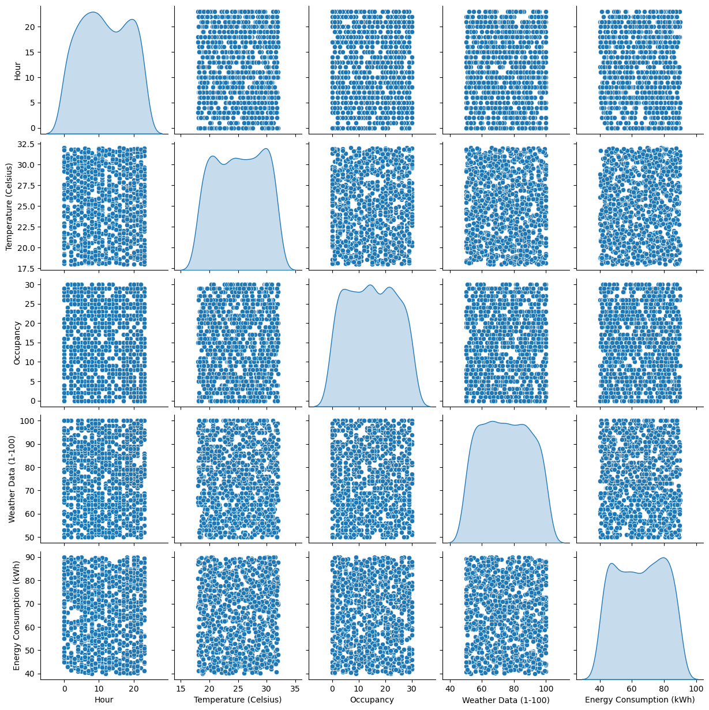
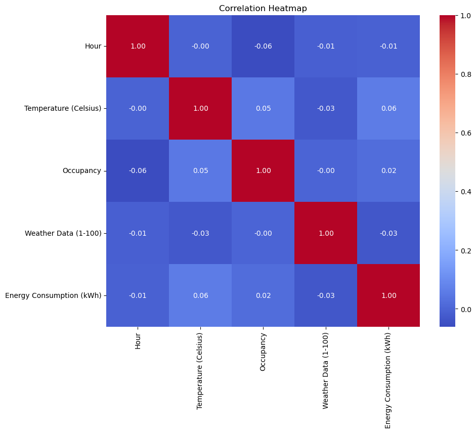

---

# Predicting Energy Consumption in a Smart Building

## Introduction

In this project, we explore the task of predicting energy consumption in a smart building. We generated synthetic data to create a realistic scenario for predictive modeling. We applied multiple regression models, including Linear Regression, Decision Tree Regressor, Random Forest Regressor, and Support Vector Regressor, to address this problem.

## Data Generation

We generated synthetic data for our modeling using Python. The data includes the following features:

- Date
- Hour
- Temperature (Celsius)
- Occupancy (Number of occupants)
- Weather Data (scaled from 1-100)
- Energy Consumption (kWh)

Here is the Python code used for data generation:

```python
import pandas as pd
import random
from datetime import datetime, timedelta

# Initialize an empty list to store data
data = []

# Define the date range
start_date = datetime(2023, 9, 1)
end_date = datetime(2023, 9, 30)
date_range = [start_date + timedelta(days=i) for i in range((end_date - start_date).days + 1)]

# Generate 1000 random data points
for _ in range(1000):
    date = random.choice(date_range)
    hour = random.randint(0, 23)
    temperature = random.uniform(18, 32)  # Celsius
    occupancy = random.randint(0, 30)  # Number of occupants
    weather_data = random.randint(50, 100)  # Weather data (scaled from 1-100)
    energy_consumption = random.uniform(40, 90)  # kWh
    
    data.append([date, hour, temperature, occupancy, weather_data, energy_consumption])

# Create a DataFrame from the data
columns = ['Date', 'Hour', 'Temperature (Celsius)', 'Occupancy', 'Weather Data (1-100)', 'Energy Consumption (kWh)']
df = pd.DataFrame(data, columns=columns)

# Save the DataFrame to a CSV file
df.to_csv('energy_consumption_data.csv', index=False)

```

## Data Exploration and Visualization

We conducted data exploration and visualization to understand the relationships between different features and to identify correlations. We used libraries like `seaborn` and `matplotlib` for visualization. The pair plot and heatmap are shown below:

### Pair Plot



### Correlation Heatmap



## Modeling

We implemented four regression models to predict energy consumption based on the provided features:

1. **Linear Regression**: We applied simple linear regression to the data. The model achieved the following results:

   - Mean Squared Error (MSE): 221.17
   - R-squared (R2): -0.01

2. **Decision Tree Regressor**: We used a decision tree regressor for modeling. The model achieved the following results:

   - Mean Squared Error (MSE): 428.67
   - R-squared (R2): -0.96

3. **Random Forest Regressor**: We applied a random forest regressor. The model achieved the following results:

   - Mean Squared Error (MSE): 248.88
   - R-squared (R2): -0.14

4. **Support Vector Regressor**: We utilized a support vector regressor for modeling. The model achieved the following results:

   - Mean Squared Error (MSE): 224.26
   - R-squared (R2): -0.03

## Findings

The findings from our modeling experiments are as follows:

- Linear Regression: The linear regression model performed moderately but showed a limited ability to capture the complexity of the energy consumption pattern. The R-squared value indicates that the model does not explain much of the variance in the data.

- Decision Tree Regressor: The decision tree regressor model exhibited a poor performance with a significantly high MSE and a negative R-squared value. This suggests overfitting, where the model learned the training data too well but failed to generalize to the test data.

- Random Forest Regressor: The random forest regressor improved upon the decision tree model but still had room for improvement. While it showed better performance, it didn't provide strong predictive power.

- Support Vector Regressor: The support vector regressor had similar performance to linear regression, indicating that it struggled to capture the complexities of the data.

## Conclusion

In this project, we explored the task of predicting energy consumption in a smart building using synthetic data. While our modeling results with synthetic data provided insights into the strengths and weaknesses of various regression models, it's important to note that real-world data may present unique challenges and complexities.

Further steps could involve:

- Gathering and utilizing real-world data to build more robust models.
- Feature engineering to improve model performance.
- Experimenting with other regression techniques and machine learning algorithms.
- Incorporating time series analysis to capture temporal patterns.

This project serves as a starting point for future investigations into energy consumption prediction and demonstrates the importance of model evaluation and validation with real-world data. 

Feel free to explore the code and data provided in this repository for educational purposes or as a reference for your own data science projects.
